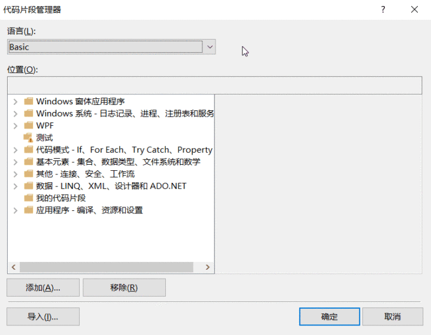
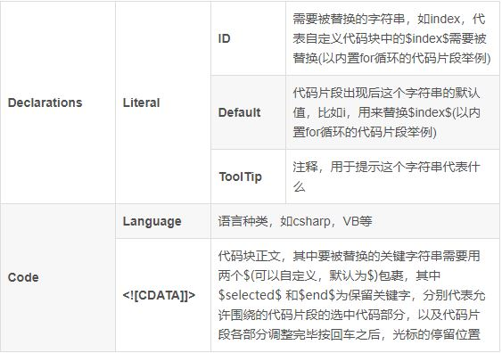
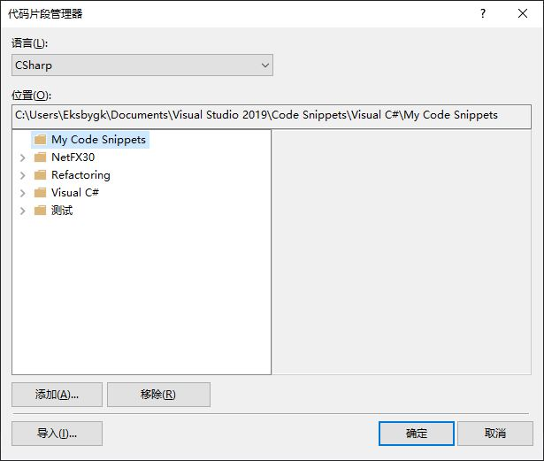
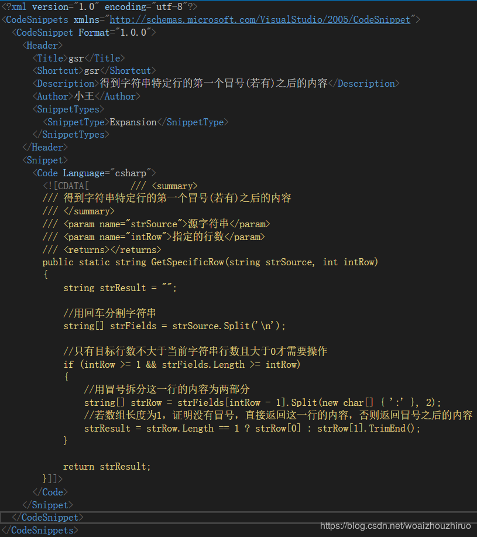
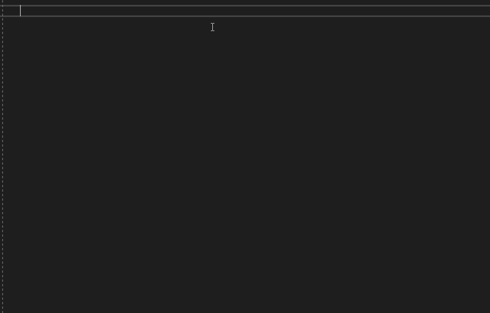

> *Code snippet* (代码片段)在VS中指的是基于IDE支持的利用快捷方式快速输入一小段，或者称之为一整块代码的功能，在日常编程，特别是在工作中写内容相似的业务代码时，利用Snippet功能，可以极大加快编程效率

## 引言

小张是一个IMIS软件的程序员，每天的工作内容就是处理各种数据表，他最近在写代码的时候，发现经常有客户需要在一个Remark字段中储存一串多行的字符串，用其中的每一行的冒号之后的内容代表一个自定义的字段，比如，在这串字符串中得到姓名字段：

*职业：程序员*

*姓名：张三*

*性别：男*

为此，他经常需要在不同的客户的程序中写同一个方法：

```c#
/// <summary>
/// 得到字符串特定行的第一个冒号(若有)之后的内容
/// </summary>
/// <param name="strSource">源字符串</param>
/// <param name="intRow">指定的行数</param>
/// <returns></returns>
public static string GetSpecificRow(string strSource, int intRow)
{
    string strResult = "";

    //用回车分割字符串
    string[] strFields = strSource.Split('\n');

    //只有目标行数不大于当前字符串行数且大于0才需要操作
    if (intRow >= 1 && strFields.Length >= intRow)
    {
        //用冒号拆分这一行的内容为两部分
        string[] strRow = strFields[intRow - 1].Split(new char[] { ':' }, 2);
        //若数组长度为1，证明没有冒号，直接返回这一行的内容，否则返回冒号之后的内容
        strResult = strRow.Length == 1 ? strRow[0] : strRow[1].TrimEnd();
    }

    return strResult;
}
```

因为写的次数确实也有好几次了，小张觉得每次遇到都写一次这个方法，实在是太蠢了，虽然其实很多时候可以去找到上次写过的，然后Copy过来，但是还是有点蠢，因为每次都不得不去回忆在哪里用到过，然后找到对应的代码文件。

他转念一想，可以放在公司的公用代码库(Code Library)里作为一个公用方法，就可以直接调用啦，可不成想，这个做法却遭到了一个老同事的反对，同事这样说：“不要整天你觉得有一个方法很常用就往库里面加，谁知道你写的方法可不可靠，而且谁都像你这样动不动就往里面加东西的话，以后里面方法一大堆，谁找得到。”

好吧，觉得有点道理，又觉得没什么道理，不过确实也是这样，有时候你觉得好的东西，别人不一定觉得好，你觉得值得分享的东西，别人可能觉得没价值。既然如此，只能再想想办法啦。

**忽然，小张想到，平时在写for循环和定义属性的时候，经常会这样做：**


**在代码中输入for，IDE会提示有可用的代码片段，双击Tab键就会出现属于for循环的内置代码片段：**

```c#
for (int i = 0; i < length; i++)
{

}
```

**此时，光标会定位在"i"处，然后可以把"i"改成自己想要的局部变量名，再按Tab键，可以看到后面的两个"i"都会随之改变，之后光标会定位在"length"处，把"length"改成自己想要的数，按Enter键，可以看到光标定位在了for循环体中，可以开始写循环体中的代码了**

**如此方便的功能，能否自己DIY，创建一些属于自己的代码片段呢，小张搜索了[MSDN文档]https://docs.microsoft.com/zh-cn/visualstudio/ide/code-snippets?view=vs-2019)相关内容，发现结论是肯定的，甚至可以说这个功能就是为DIY而生的，他总结了一些有价值的信息**

------

## 代码片段的存放位置及其内容

打开Visual Studio → 工具 → 代码片段管理器 → 选择编程语言

可以看到出现了一些文件夹供选择，我们可以在这里找到刚刚出现的那个for循环的代码片段：



根据图示文件夹，找到**for.snippet**文件，双击打开(会默认自动用VS打开，没有的话可以用其它任意的文本编辑器打开)，可以看到是一个XML结构的文本，也就是说，snippet实际上是以XML文件来储存的，那么现在问题就简单了，为了快速说明这个文件，我们为其添加一些注释


**可以看到，一个Snippet文件大致分为两个部分：**

**<Header></Header>标签之间的一些关于属性的定义**

| **Title**       | 标题                                                         |
| --------------- | ------------------------------------------------------------ |
| **Shortcut**    | 在IDE中以何快捷键触发                                        |
| **Description** | Snippet内容描述                                              |
| **Author**      | 作者                                                         |
| **SnippetType** | Snippet种类，是否允许插入在光标处，是否允许围绕在选中代码两边(选中一段代码，按Ctrl+K,Ctrl+X，然后选中支持此属性的Snippet，就能把这段代码放在选中代码的两边)等 |


***\*<Snippet></Snippet>\**标签之间的一些关于代码片段内容的定义(Markdown不支持复杂的表格，这里用图片来表示)**




## 如何自定义并使用自己的代码片段

打开Visual Studio → 工具 → 代码片段管理器 → 选择编程语言



可以看到VS为我们内置了一个代码片段文件夹，叫做My Code Snippets，我们只要自己创建一个snippet文件(复制内置的过来调整即可)，然后在里面写上自己想要的内容，放进这个文件夹就行啦，比如前言中小张的需求，我们为他编写了一个snippet



因为他的需求比较简单，只是想要快速输入方法，所以内容主要是方法体本身，没有$包含的字符串，我们把这个文件存进刚刚说的My Code Snippets文件夹，可以看到，不需要重启VS，打开代码片段管理器，这里已经出现了我们自定义的代码片段


试着使用看看，在IDE中输入快捷方式"gsr"，可以看到一整个方法体直接出现了，小张终于可以解放双手了，他接下来有了新的想法，把Snippet分类，做一个属于自己的代码片段库，里面包含各种自己常用的代码片段，这样不但可以方便查找常用的方法，不用去仔细回忆，寻找各种文件，还能作为自己的一个知识储备库，想到这里，他笑开了花



## 后记：

**合理使用代码片段确实能给我们的编程提高不少效率，但是编写代码片段本身也是一个有点消耗时间的过程，笔者为了进一步解放双手，用Winform开发了一个简单的小工具用于快速编写和储存Snippet，大家可以随意取用，代码在https://github.com/GadHao/SnippetManager**

**晚安啦各位！**