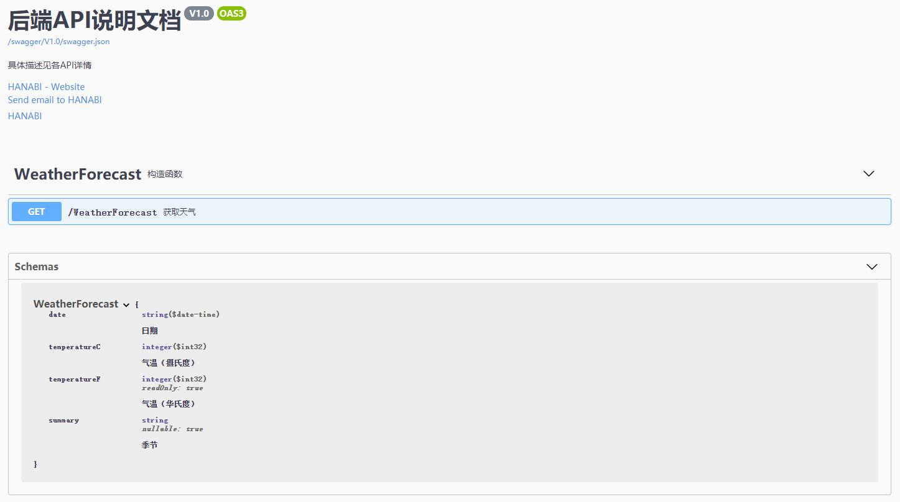

# .NET Core前后端分离(1) - Swagger的使用

> 在前后端分离过程中,API文档是非常重要的,在项目搭建的第一步,我们使用Swagger来实现这一点

## 引入Nuget包

在项目中安装*Swashbuckle.AspNetCore.SwaggerGen*和*Swashbuckle.AspNetCore.SwaggerUI*

## 配置服务

### 在*Startup.cs*文件的*ConfigureServices*函数中添加服务:

```CSharp
// 类中定义常量,方便后续编辑
private const string ApiVersion = "V1.0";

// ConfigureServices函数内添加代码
services.AddSwaggerGen(setup =>
{
    // 设置Swagger文档的名称，描述信息等
    setup.SwaggerDoc(ApiVersion, new OpenApiInfo
    {
        Version = ApiVersion,
        Title = "后端API说明文档",
        Description = "具体描述见各API详情",
        Contact = new OpenApiContact { Name = "HANABI", Email = "Narancia86@outlook.com", Url = new Uri("https://colasaikou.com/") },
        License = new OpenApiLicense { Name = "HANABI", Url = new Uri("https://colasaikou.com/") }
    });

    // 设置API的排序规则
    setup.OrderActionsBy(description => description.RelativePath);

});
```

### 在*Startup.cs*文件的*Configure*函数中启动HTTP管道中间件:

```CSharp
public void Configure(IApplicationBuilder app, IWebHostEnvironment env)
{
    if (env.IsDevelopment())
    {
        app.UseDeveloperExceptionPage();
    }

    app.UseSwagger();
    app.UseSwaggerUI(c =>
    {
        c.SwaggerEndpoint($"/swagger/{ApiVersion}/swagger.json", ApiVersion);

        // 在launchSettings.json把launchUrl设置为空,表示程序启动时访问根域名,并且在这里把Swagger页面路由前缀设置为空,即可在API根域名访问Swagger界面
        c.RoutePrefix = "";
    });

    app.UseRouting();

    app.UseAuthorization();

    app.UseEndpoints(endpoints =>
    {
        endpoints.MapControllers();
    });
}
```

### 配置API注释

> 此时启动API已经可以看到Swagger界面了，但是可以看到，此时这些API是没有注释的，现在进行最后一步，给他们加上注释

在项目名称处点击右键-属性-生成，勾选上XML文档文件，并设置好文档的相对路径，对项目进行生成，发现项目下已经出现了对应的注释XML文档，在错误列表中会出现很多警告，根据警告类型同样在项目的属性-生成中添加取消显示警告*1591*

此时,在Controller代码中加上注释,并在*ConfigureServices*函数的Swagger服务设置中添加内容:
```CSharp
// 设置接口注释信息
var xmlPath = Path.Combine(AppContext.BaseDirectory, "Hanabi.Blog.xml");
setup.IncludeXmlComments(xmlPath, true);
```

重新生成项目并运气,此时可以看到API说明中已经出现了添加的注释内容




如果想忽略某个API，使其不显示，在*Controller*或者*Action*上方加上`[ApiExplorerSettings(IgnoreApi = true)]`特性即可