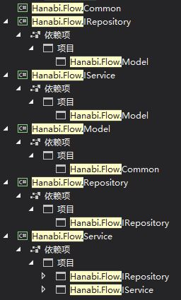

> 建立好数据库，注入了ORM相关类之后，就开始构建我们通过ORM和数据库进行交互的层（*Repository*层）和只负责调用仓储层的(*Service*层)

## 什么是仓储层，为什么要分层

Repository(仓储)是DDD(领域驱动设计)中的经典思想，可以归纳为**介于实际业务层(领域层)和数据访问层之间的层，能让领域层能在感觉不到数据访问层的情况下，完成与数据库的交互**

和以往的DAO层相比，Repository层的设计理念更偏向于面向对象，而淡化直接对数据表进行的CRUD操作

**那么，为什么要建立Service层呢**

*Service*层是位于*Controller*和*Repository*层之间的，处理业务逻辑的层，主要目的是解耦，让每个层可以各自专注自己的事情，而无需在意具体的实现

## 创建各层的接口

### 为什么还需要创建接口

**接口可以很方便的规定两个类之间的交互标准，是一种规范，在协同开发的时候尤其重要，特别是在描述多个有相似行为的类的时候**

###  开始创建仓储层接口

首先添加项目*Hanabi.Flow.IRepository*，然后添加文件夹*Base*，创建*IBaseRepository.cs*文件，这将作为基类接口，声明一些所有仓储层接口都拥有的公共功能

```c#
/// <summary>
/// 基类仓储接口
/// </summary>
/// <typeparam name="TEntity">Model类型</typeparam>
public interface IBaseRepository<TEntity> where TEntity: class
{
    Task<TEntity> QueryById(object objId);
    Task<TEntity> QueryById(object objId, bool blnUseCache = false);
    Task<List<TEntity>> QueryByIDs(object[] lstIds);

    Task<int> Add(TEntity model);

    Task<int> Add(List<TEntity> listEntity);

    Task<bool> DeleteById(object id);

    Task<bool> Delete(TEntity model);

    Task<bool> DeleteByIds(object[] ids);

    Task<bool> Update(TEntity model);
    Task<bool> Update(TEntity entity, string strWhere);
    Task<bool> Update(object operateAnonymousObjects);

    Task<bool> Update(TEntity entity, List<string> lstColumns = null, List<string> lstIgnoreColumns = null, string strWhere = "");

    Task<List<TEntity>> Query();
    Task<List<TEntity>> Query(string strWhere);
    Task<List<TEntity>> Query(Expression<Func<TEntity, bool>> whereExpression, string strOrderByFileds);
    Task<List<TEntity>> Query(Expression<Func<TEntity, bool>> whereExpression, Expression<Func<TEntity, object>> orderByExpression, bool isAsc = true);
    Task<List<TEntity>> Query(string strWhere, string strOrderByFileds);

    Task<List<TEntity>> Query(Expression<Func<TEntity, bool>> whereExpression, int intTop, string strOrderByFileds);
    Task<List<TEntity>> Query(string strWhere, int intTop, string strOrderByFileds);
    Task<List<TEntity>> QuerySql(string strSql, SugarParameter[] parameters = null);
    Task<DataTable> QueryTable(string strSql, SugarParameter[] parameters = null);

    Task<List<TEntity>> Query(
        Expression<Func<TEntity, bool>> whereExpression, int intPageIndex, int intPageSize, string strOrderByFileds);
    Task<List<TEntity>> Query(string strWhere, int intPageIndex, int intPageSize, string strOrderByFileds);


    Task<PageModel<TEntity>> QueryPage(Expression<Func<TEntity, bool>> whereExpression, int intPageIndex = 1, int intPageSize = 20, string strOrderByFileds = null);

    Task<List<TResult>> QueryMuch<T, T2, T3, TResult>(
        Expression<Func<T, T2, T3, object[]>> joinExpression,
        Expression<Func<T, T2, T3, TResult>> selectExpression,
        Expression<Func<T, T2, T3, bool>> whereLambda = null) where T : class, new();
}

```
接着，根据之前建立的*Model*类，继承这个基类接口来构建接口(以*UserRole*为例)

```c#
/// <summary>
/// 继承基类接口创建的接口，若有额外方法可以在此处扩展
/// </summary>
public interface IUserRoleRepository : IBaseRepository<UserRole>
{
}
```

考虑到事务控制的需要，在仓储接口层新增文件夹*UnitOfWork*,实现事务控制单元，代码为

**IUnitOfWork.cs**

```c#
public interface IUnitOfWork
{
    SqlSugarClient GetDbClient();

    void BeginTran();

    void CommitTran();
    void RollbackTran();
}
```


###  开始创建服务层接口

和*IRepository*类似，添加项目*Hanabi.Flow.IService*，然后添加文件夹*Base*，创建*IBaseService.cs*文件，这将作为基类接口，声明一些所有服务层接口都拥有的公共功能，因为这里是和仓储层保持统一的，代码就不贴上来了，之后，根据*Model*类继承这个基类接口构建每个接口

## 根据抽象接口实现各接口

已经定义好了各接口，接下来根据各接口定义的规范来实现接口，首先新建项目*Hanabi.Flow.Repository*，添加对*Hanabi.Flow.IRepository*的依赖，先来实现基类接口

新建文件夹*Base*，新建文件*BaseRepository.cs*，首先先完成其构造函数

```c#
public class BaseRepository<TEntity> : IBaseRepository<TEntity> where TEntity : class, new()
{
}
```

首先，因为要通过ORM与数据库交互，先实现工作单元接口(IUnitOfWork)

```c#
public class UnitOfWork : IUnitOfWork
{
    private readonly MyContext _myContext;

    public UnitOfWork(MyContext myContext)
    {
        _myContext = myContext;
    }

    public void BeginTran()
    {
        GetDbClient().BeginTran();
    }

    public void CommitTran()
    {
        GetDbClient().CommitTran();
    }

    public SqlSugarClient GetDbClient() => _myContext.Db;

    public void RollbackTran()
    {
        GetDbClient().RollbackTran();
    }
}
```

使用VS的快速重构来实现这个接口，通过在各个函数中利用注入的*IUnitOfWork*实现使用ORM数据交互，代码太长，就不贴在这里了，可以在*Github*看详细代码

之后再分别实现*UserRole*等Model类的仓储接口，这里以*UserRole*为例

```c#
public UserRoleRepository(IUnitOfWork unitOfWork) : base(unitOfWork)
{

}
```

最后，添加*Hanabi.Flow.Service*项目，用来实现*IService*接口项目中的接口，项目的整体框架就完成了

## 补充

定义完所有的接口，并实现完它们的函数之后，可以看看我们各个项目的依赖关系



先定义了仓储层和服务层的接口层，它们需要用到对应的*Model*类型，所以都引用了*Model层*

接着用*Repository*层实现了*IRepository*层的接口，最后在*Service*层实现*IService*层的接口，并通过*IRepository*层和仓储层进行交互